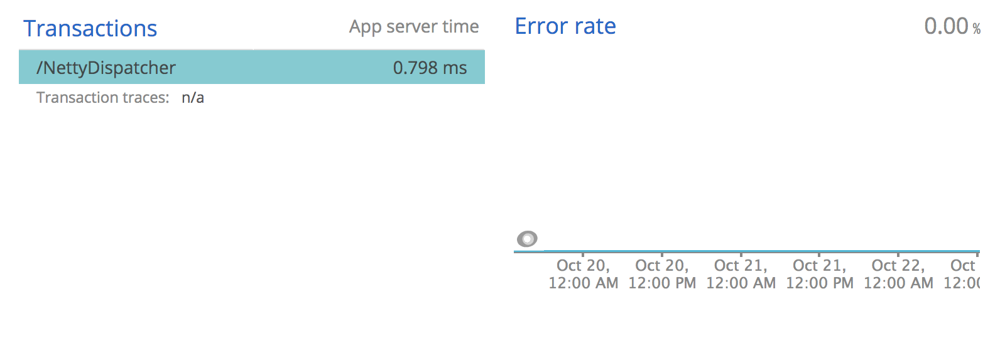
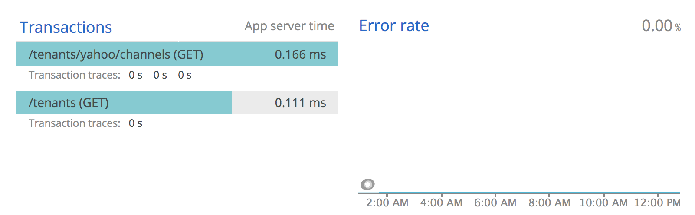

# NewRelic Java Agent v6.1.0 Netty Transactions Fix

Base NewRelic Java Agent shows web transactions as single `/NettyDispatcher` transaction:



This version NewRelic Java Agent shows web transactions based on `uri` and `method`:



## Usage

### Standalone

Get fixed version of agent:

```sh
docker run --rm  mshauneu/newrelic-java-agent-6.1.0-instrumentation-netty-fix cat /newrelic.jar > ./newrelic.jar
```

Start an java application:

```sh
java -javaagent:newrelic.jar ...
```

### Inside Docker container

```Dockerfile
FROM mshauneu/newrelic-java-agent-6.1.0-instrumentation-netty-fix:latest AS newrelic

FROM ...
COPY --from=newrelic /newrelic.jar .

```